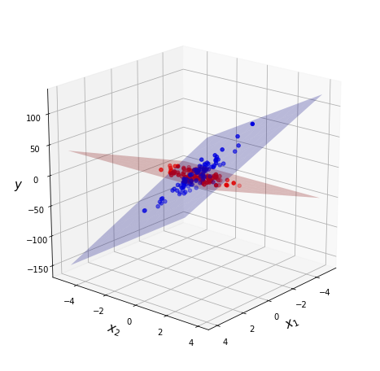
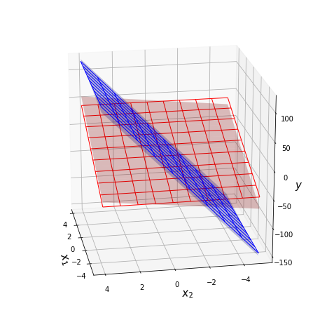

*******
Example
*******

Requirements
============

It is recommended make virtualenv and install all next packages
in this virtualenv.

::

    torch==1.4.0
    numpy==1.18.1
    matplotlib==2.2.4
    mixturelib==0.2.*

Include packages.

.. code:: python
    
    import torch
    import numpy as np
    import matplotlib.pyplot as plt
    from mpl_toolkits.mplot3d import Axes3D

    from mixturelib.mixture import MixtureEM
    from mixturelib.local_models import EachModelLinear
    from mixturelib.hyper_models import HyperExpertNN, HyperModelDirichlet

Preparing the dataset
=====================

Generate dataset. This dataset contains two different planes.

.. code:: python

    np.random.seed(42)

    N = 200
    noise_component = 0.8
    noise_target = 5

    X = np.random.randn(N, 2)
    X[:N//2, 1] *= noise_component
    X[N//2:, 0] *= noise_component

    real_first_w = np.array([[10.], [0.]])
    real_second_w = np.array([[0.], [30.]])

    y = np.vstack([X[:N//2]@real_first_w, X[N//2:]@real_second_w])\
        + noise_target*np.random.randn(N, 1)

Dataset visualisation. Blue color corresponds to one local model and
red corresponds to another.

Convert the dataset into ``torch.tensor`` format.

.. code:: python

    torch.random.manual_seed(42)
    X_tr = torch.FloatTensor(X)
    Y_tr = torch.FloatTensor(y)

Mixture of Model
================

Consider an example of a mixture of model. In this case the contribution of 
each model does not depend on the sample from dataset.

Init local models. We consider linear model
:class:`mixturelib.local_models.EachModelLinear` as local model.

.. code:: python
    
    torch.random.manual_seed(42)
    first_model = EachModelLinear(input_dim=2)
    secode_model = EachModelLinear(input_dim=2)

    list_of_models = [first_model, secode_model]

Init hyper model --- :class:`mixturelib.hyper_models.HyperModelDirichlet`. 
In this case contribution of each model does not depend on sample from dataset.
It is suggested that the contribution of each model has a 
Dirichlet distribution.
The hyper model parameters is a parameter of Dirichlet distribution.

.. code:: python

    HpMd = HyperModelDirichlet(output_dim=2)

Init mixture model. The mixture model is simple function which weighs 
local models answers. Weights are generated by hyper model `HpMd`.

.. code:: python

    mixture = MixtureEM(HyperParameters={'beta': 1.},
                        HyperModel=HpMd,
                        ListOfModels=list_of_models,
                        model_type='sample')

Train mixture model on the give dataset.

.. code:: python

    mixture.fit(X_tr, Y_tr)

Local models parameters after training procedure.
In our task, each model is a simple plane in 3D space.

.. code:: python

    predicted_first_w = mixture.ListOfModels[0].W.numpy()
    predicted_second_w = mixture.ListOfModels[1].W.numpy()

Visualization of the real and predicted planes on the chart. 

.. code:: python

    fig = plt.figure(figsize=(8, 8))

    ax = fig.add_subplot(111, projection='3d')

    grid_2d = np.array(np.meshgrid(range(-5, 5), range(-5, 5)))
    xx, yy = grid_2d

    first_z = (predicted_first_w.reshape([-1, 1, 1])*grid_2d).sum(axis=0)
    second_z = (predicted_second_w.reshape([-1, 1, 1])*grid_2d).sum(axis=0)
    ax.plot_surface(xx, yy, first_z, alpha = 0.25, color = 'red', label='predicted')
    ax.plot_surface(xx, yy, second_z, alpha = 0.25, color = 'blue', label='predicted')

    first_z = (real_first_w.reshape([-1, 1, 1])*grid_2d).sum(axis=0)
    second_z = (real_second_w.reshape([-1, 1, 1])*grid_2d).sum(axis=0)
    ax.plot_wireframe(xx, yy, first_z, linewidth=1, color = 'red')
    ax.plot_wireframe(xx, yy, second_z, linewidth=1, color = 'blue')

    ax.view_init(20, 170)

    ax.set_xlabel('$x_1$', fontsize=15, fontweight="bold")
    ax.set_ylabel('$x_2$', fontsize=15, fontweight="bold")
    ax.set_zlabel('$y$', fontsize=15, fontweight="bold")

    plt.show()

The surfaces with grid are real planes. 
The surfaces without grid are predicted planes.

Mixture of Experts
==================

Now consider an example of a mixture of experts on the same dataset. In this 
case contribution of each model is depend on sample from dataset.

Init local models. We consider linear model
:class:`mixturelib.local_models.EachModelLinear` as local model.

.. code:: python

    torch.random.manual_seed(42)
    first_model = EachModelLinear(input_dim=2)
    secode_model = EachModelLinear(input_dim=2)

    list_of_models = [first_model, secode_model]

Init hyper model --- gate function 
:class:`mixturelib.hyper_models.HyperExpertNN`. In this case contribution of
each model is depend on sample from dataset. Gate function is a simple neural 
network with softmax on the last layer.

.. code:: python

    HpMd = HyperExpertNN(input_dim=2, hidden_dim=5, 
                         output_dim=2, epochs=100)

Init mixture model. The mixture model is simple function which weighs 
local models answers. Weights are generated by hyper model `HpMd`.

.. code:: python

    mixture = MixtureEM(HyperParameters={'beta': 1.},
                        HyperModel=HpMd,
                        ListOfModels=list_of_models,
                        model_type='sample')

Train mixture model on the give dataset.

.. code:: python

    mixture.fit(X_tr, Y_tr)

Local models parameters after training procedure.
In our task, each model is a simple plane in 3D space.

.. code:: python

    predicted_first_w = mixture.ListOfModels[0].W.numpy()
    predicted_second_w = mixture.ListOfModels[1].W.numpy()

Visualization of the real and predicted planes on the chart. 

.. code:: python

    fig = plt.figure(figsize=(8, 8))

    ax = fig.add_subplot(111, projection='3d')

    grid_2d = np.array(np.meshgrid(range(-5, 5), range(-5, 5)))
    xx, yy = grid_2d

    first_z = (predicted_first_w.reshape([-1, 1, 1])*grid_2d).sum(axis=0)
    second_z = (predicted_second_w.reshape([-1, 1, 1])*grid_2d).sum(axis=0)
    ax.plot_surface(xx, yy, first_z, alpha = 0.25, color = 'red', label='predicted')
    ax.plot_surface(xx, yy, second_z, alpha = 0.25, color = 'blue', label='predicted')

    first_z = (real_first_w.reshape([-1, 1, 1])*grid_2d).sum(axis=0)
    second_z = (real_second_w.reshape([-1, 1, 1])*grid_2d).sum(axis=0)
    ax.plot_wireframe(xx, yy, first_z, linewidth=1, color = 'red')
    ax.plot_wireframe(xx, yy, second_z, linewidth=1, color = 'blue')

    ax.view_init(20, 170)

    ax.set_xlabel('$x_1$', fontsize=15, fontweight="bold")
    ax.set_ylabel('$x_2$', fontsize=15, fontweight="bold")
    ax.set_zlabel('$y$', fontsize=15, fontweight="bold")

    plt.show()

The surfaces with grid are real planes. 
The surfaces without grid are predicted planes.

